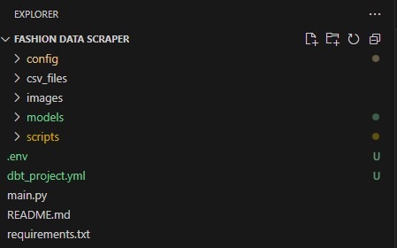

# Web Scraper for Competitor Price Analysis - Used During 4 Years Running an Off-Price Retail Business

As part of running an off-price retail business for over four years, I developed a custom web scraper to automate the process of gathering pricing data from competitors. This tool allowed me to rapidly collect and analyze pricing for hundreds of thousands of products across various categories, significantly reducing manual labor and improving the efficiency of our pricing strategy.

The scraper utilizes Selenium to extract raw product data, which is then transformed and stored in **Snowflake**, a powerful cloud data warehouse. This process enables detailed insights into product prices by category, gender, and brand, helping us stay competitive and agile in the retail market.

## Features

- **Automated Price Collection**: Scrapes competitor websites for product pricing, reducing the manual effort of gathering price data.
- **Data Transformation**: Extracts only the relevant data (e.g., price and brand) and organizes it into a structured format for further analysis.
- **Scalable Design**: Handles large volumes of product data and works across multiple categories and genders.
- **Data Storage in Snowflake**: Saves transformed data into CSV files, which are then loaded into Snowflake after being staged for faster processing.
- **Efficient Staging with Snowflake**: Utilizes Snowflake's stage area to bulk load CSV files, skipping line-by-line execution for performance improvements.
  
## How It Works

### Step 1: Web Scraping with Selenium
The process begins by using Selenium to navigate through product pages of competitor websites, scraping essential details like product names, brands, prices, and other relevant information. For each category of clothing, a URL is formed with pagination support to collect data across multiple pages.

### Step 2: Raw Data Storage
The raw data is saved into CSV files, with each file being named according to the gender and category of the products it contains (e.g., `raw_data_womens_dresses.csv`, `raw_data_mens_t-shirts.csv`). This structured naming system helps keep the data organized and easy to track.


### Step 3: Data Transformation
Once the raw data is collected, a function parses the CSV files, extracting only the most relevant fields—product prices and brand names. A file name parser reads the CSV file name to extract the gender and category information, which is then used to create a dictionary for each product. These dictionaries are collected in a list, allowing us to handle the data in a more structured and easily accessible format.

### Step 4: Loading Data into Snowflake
The list of dictionaries is transformed into CSV files, which are then stored in a **Snowflake stage** for loading into Snowflake. The process ensures that if a file already exists in the stage, it is overwritten, avoiding duplication. By using Snowflake's **COPY INTO** command, we efficiently load the data into Snowflake without processing it line by line, which is far more efficient for large data volumes.

### Step 5: Price Aggregation and Reporting
Using SQL aggregate functions, we are able to quickly generate reports that show the price ranges, averages, and other key metrics for each product category. This data helps us make more informed decisions about our own pricing strategy, ensuring that we remain competitive in a rapidly changing market.


## Project Structure



## How to Use

1. **Set up the environment**:
   - Create a virtual environment:
     ```bash
     python -m venv venv
     ```
   - Activate the virtual environment:
     - On Windows:
       ```bash
       venv\Scripts\activate
       ```
     - On macOS/Linux:
       ```bash
       source venv/bin/activate
       ```
   - Install the required dependencies from `requirements.txt`:
     ```bash
     pip install -r requirements.txt
     ```

2. **Configure the URLs**:
   - To use this scraper, you will need to add **URLs for page 1** of each category you wish to scrape in the `urls.py` file, as **shown in the example below**. **PLEASE NOTE** that this scraper is specifically designed to work with URLs from one of the largest online fashion retailers in Europe. For privacy purposes, I have not included the retailer's name here. It is important that you source the correct URLs from this specific retailer and ensure they are for **page 1** of the desired categories, as this is where the scraper will begin.
   - Example:

   

3. **Set up Snowflake and .env**:
   - Set up your Snowflake account and create a **stage** in your database to store the CSV files.
   - In the root directory of your project, create a `.env` file with your Snowflake credentials:
     ```env
     SNOWFLAKE_ACCOUNT=your_account
     SNOWFLAKE_USER=your_username
     SNOWFLAKE_PASSWORD=your_password
     SNOWFLAKE_WAREHOUSE=your_warehouse
     SNOWFLAKE_DATABASE=your_database
     SNOWFLAKE_SCHEMA=your_schema
     ```
     This will allow the application to connect to Snowflake using the credentials defined in the `.env` file.

4. **Run the Scraper**:
   - Once the URLs and Snowflake connection are configured, run `main.py` to start the scraping, transformation, and loading process:
     ```bash
     python main.py
     ```

5. **View Data**:
   - The scraper will automatically collect product data from the specified URLs, transform the raw data, and load it into Snowflake.
   - You can then query Snowflake to generate reports on product pricing by category, gender, and brand.

## Key Benefits

- **Efficiency**: This process automated what would have otherwise been a time-consuming, manual task. By scraping and storing competitor data regularly, I was able to get fresh, up-to-date pricing information without dedicating hours to manual research.
- **Scalability**: The scraper was built to scale, handling data from multiple product categories and thousands of products.
- **Data-Driven Decisions**: With aggregated price reports, I was able to better understand market trends and pricing strategies, ensuring that my business stayed competitive.

## Conclusion

This project represents a combination of my technical skills in web scraping, data transformation, and database management, applied directly to real-world business operations. It not only saved valuable time but also provided actionable insights into competitive pricing, which were crucial for maintaining a competitive edge in the retail industry.
